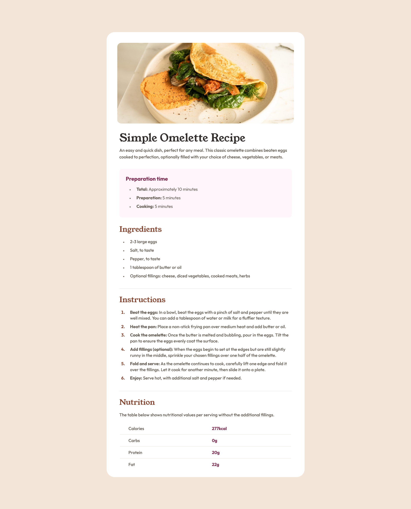

# Frontend Mentor - Recipe page solution

This is a solution to the [Recipe page challenge on Frontend Mentor](https://www.frontendmentor.io/challenges/recipe-page-KiTsR8QQKm). Frontend Mentor challenges help you improve your coding skills by building realistic projects. 

## Table of contents

- [Overview](#overview)
  - [Screenshot](#screenshot)
  - [Links](#links)
- [My process](#my-process)
  - [Built with](#built-with)
- [Author](#author)

## Overview

### The challenge

Users should be able to:

- View the optimal layout for the site depending on their device's screen size

### Screenshot

### Links

- Solution URL: https://www.frontendmentor.io/solutions/recipe-page-built-with-sass-and-bem-notation-vBnNhGmLjF
- Live Site URL: https://danielmrz-dev.github.io/recipe-page/

## My process

### Built with

- Semantic HTML5 markup
- BEM Notation
- SASS
- Flexbox
- Grid
- Mobile-first workflow

## Author

- Frontend Mentor - [@danielmrz-dev](https://www.frontendmentor.io/profile/danielmrz-dev)
- Twitter - [@danielmrz_dev](https://www.twitter.com/danielmrz_dev)
